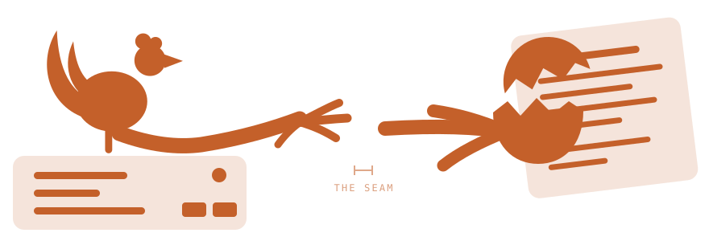

# Roost and hatchery: what each one abstracts

Two tools, one lab. They are siblings on purpose, and their marks say so:
hatchery draws a cracked egg on the same perch roost draws its rooster on, same
64x64 field, same flat geometry, same `#C4602A`. The boundary is one sentence,
from hatchery's own README:

> roost owns machines; hatchery owns the stacks that hatch on them.

**Measured against the box on 2026-09-28.** The box is the truth and this page
is a hint about it, so it carries the date it was last checked. If that date is
old, run `house-check <app>` and believe the output over this page.

That sentence is easy to agree with and hard to apply while you are standing in
front of a broken deploy deciding which tool to reach for. Both can put a Dokku
app on a box. One box carries an app roost deployed **and** six services
hatchery declared. This page says what the sentence means in practice.

## The three strata

The lab is three layers deep. Each layer answers exactly one question, and the
middle layer is shared, which is precisely where the two tools get confused for
each other.

```
┌───────────────────────────────────────────────────────┬──────────────────┐
│  CONFIG                                               │  hatchery        │
│    does this service have what it needs?              │  owns            │
│    service kind + env contract · stack manifest       │                  │
├───────────────────────────────────────────────────────┼──────────────────┤
│  PLATFORM                                             │  hatchery        │
│    what runs a service, and where?                    │  declares        │
│    dokku · Cloud Run · App Runner · App Platform      │  roost           │
│                                                       │  provisions      │
├───────────────────────────────────────────────────────┼──────────────────┤
│  HARDWARE                                             │  roost           │
│    what does the platform sit on, and how does        │  owns            │
│    the outside reach it?                              │                  │
│    opi · mini · pi · CGNAT · tunnel · nginx           │                  │
└───────────────────────────────────────────────────────┴──────────────────┘

   deeper ▼   an answer at any layer is worthless if the layer under it lies
```



hatchery comes down from a declaration. roost comes up from a machine. They
meet in the middle.

| Stratum | The question | Owner | What you type |
|---|---|---|---|
| config | Does this service have what it needs to be correct? | hatchery | `config validate` · `audit` · `sync` |
| platform | What runs a service, and where? | hatchery declares, roost provisions | `service new` · `roost new` |
| hardware | What does the platform sit on, and how does the outside reach it? | roost | `roost route` · `apps` · `doctor` |

## What roost abstracts

**A name becomes a live URL.** That is the abstraction, and everything else
roost does exists to keep it true.

```
Internet ──▶ Cloudflare ──▶ tunnel (dials OUT) ──▶ nginx :80 ──▶ Dokku containers
```

`roost new myapp --swift` goes from nothing to a served app in about forty
seconds: Dokku app, domain, scaffold, deploy, tunnel route, verify. It works
behind CGNAT with no public IP and no port forwarding, because the tunnel dials
out rather than waiting to be dialled.

Below that line roost owns everything true of the **machine** rather than of any
app on it: day-2 Dokku operations over ssh (`apps`, `ps`, `logs`, `restart`,
`config`, `prune`, `backup`), per-node telemetry, the fleet board, the
smart-plug and Home Assistant pollers, and the schedules that run all of it. Its
configuration is `~/.roostrc`, a flat file of `ROOST_*` keys read by splitting
on `=`, with secrets in separate chmod-600 dotfiles.

roost is **imperative and scheduled**. It is a toolbelt with a cron behind it.

## What hatchery abstracts

**A service kind has an environment contract, and the contract is data.** That
is the abstraction, and it is what lets hatchery answer questions roost cannot.

A manifest names stacks, a stack holds services, and a service has a kind
(`mwserver`, `payment-gateway`) and a backend. Because the contract is data
rather than code:

- `config validate` says a service is misconfigured **before** anything is deployed.
- `config audit` says the live box has drifted from what was declared.
- `stack clone` decides key by key what a copy into another environment should do: carry it, rewrite the names in it, mint a fresh one, or refuse and say why. Nothing that points at the source's database or grants the source's authority is ever copied.

Providers are the top level rather than an afterthought. The dashboard opens on
which backends exist and whether **this machine** is configured for each, before
anything is defaulted to one.

hatchery is **declarative and convergent**. It is a model with a reconciler
behind it.

### It does not run inside what it manages

There is no Dockerfile in the hatchery repo on purpose. Running it as an app on
the box it administers means a restart of that stack kills the tool mid-action,
and the moment you most need it, box wedged and apps down, is exactly the moment
it would not be there.

So it is a local process. On this lab it runs on the laptop, bound to loopback
and token-gated, and the mini's status collector reaches it across the LAN to
draw the Stacks tab on the board.

It is also declared, which is the point rather than a contradiction: `hatchery-serve`
is a `job` in the `air` stack, and it fetches its own token from vault at boot.
Staying outside what it manages is about the blast radius of a restart, not
about escaping the declaration.

## Where the seam is

The two meet on one box. `opi.jimmyhoughjr.net` carries the whole declared
estate, and that now includes the `status` app and this docs site.

```
  the writers                             opi.jimmyhoughjr.net · dokku
                                        ┌──────────────────────────────────┐
  hatchery                              │  the estate stack, declared:     │
  air · declared job  ──declares───────▶│  coop · pulse · rookery · vault  │
       │              · audits          │  status · docs · gigs · ci-live  │
       │ LAN, curl                      │  mwlab · mwlab-2 · forge         │
       ▼                                │                                  │
  statusgen collectors ◀── GitHub       │                                  │
  mini · every 900s        Actions      │                                  │
       │                                │                                  │
       ▼                                │                                  │
  status-site clone                     │  status app ─▶ the board         │
       │  git push --force (retry)      │                                  │
       └───────────────────────────────▶│                                  │
                                        └──────────────────────────────────┘
```

**The declaration half of this gap closed on 2026-09-08.** `status` and `docs`
are services in the `estate` stack (`estate/status.tf`, `estate/docs.tf`), each
with a kind, a config file and expected domains. So `hatchery config audit`
answers for them like any other service, and `house-check status` reads the box
against the declaration and exits non-zero when the two disagree.

**What did not close is delivery.** roost still publishes the board exactly as
it always has: collect, validate the data, commit, and force-push to dokku in a
retry loop (`bin/status.sh`). So, for the `status` app today:

- What it should be is declared, and drift against it is auditable.
- How a new board gets there is still a shell script pushing a branch.
- `validate-board.py` gates the board **data**, and says nothing about the deployment.
- The push is forced, and in a retry loop, because the mini's LAN access flaps.

That is the honest shape of it now: **hatchery owns what the status app is,
roost still owns how it changes.**

The named next step is not to make the diagram symmetrical. It is that every
status push rebuilds the app image, because the board data lives inside the
image, while the code changes at most daily and the data changes every cycle.
Separating them, so the container serves data from a mounted or synced
directory and an image build happens only when the renderer changes, is the
piece worth doing.

## Which tool do I reach for

| The thing in front of you | Reach for |
|---|---|
| A new app needs a URL on the lab box | `roost new` |
| A subdomain needs publishing through the tunnel | `roost route` |
| An app is up but wrong, and you want its logs or its env | `roost logs` · `roost config` |
| A box is out of disk | `roost prune` |
| The status board is stale or wrong | `roost status` |
| A service needs an env key and you do not know which | `hatchery config validate` |
| The live box may have drifted from what was declared | `hatchery config audit` |
| You are about to change an app and want the before and after | `house-check <app>` |
| You need this stack again in another environment | `hatchery stack clone` |
| Something is down and you want the history of when it turned | `hatchery events` |
| You are starting from an empty directory and a bare box | `hatchery stack new` |

## Where the board already shows all three

The Clauffice status board reads bottom-up through the same layers, which is a
decent way to learn them:

- **Stacks** is hatchery's own answer, live: which stacks are declared, which services answer, on which backend, at what latency. That is the config stratum.
- **Deployed servers** is what is actually running on the Dokku box. That is the platform stratum.
- The **fleet** board and the node telemetry are the machines themselves. That is the hardware stratum.

When those three disagree, the disagreement is the finding. A service that is
declared, is not running, on a box that is up, is a different problem from all
three being down.
